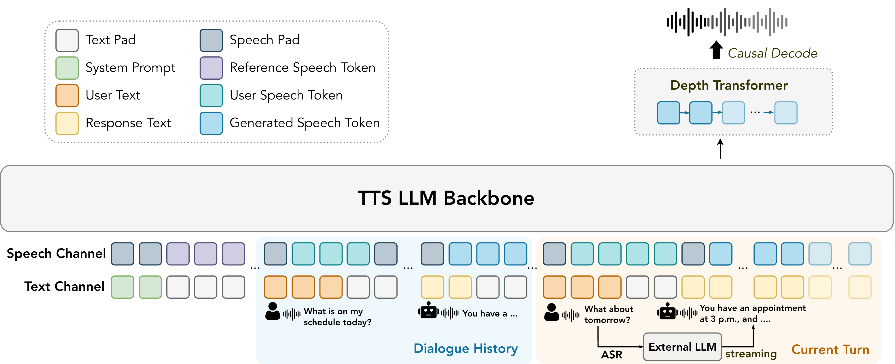

# MOSS-TTS-Realtime

### Context-Aware Speech Synthesis for Real-Time Voice Agents

**Yiwei Zhao1,2,3,*, Yaozhou Jiang1,3,*, Botian Jiang1,2,3, Kexin Huang1, Yiyang Zhang1,2,3, Zhe Xu1,2,3, Yuqian Zhang1,2,3, Xiaogui Yang3, Qingyuan Cheng3, Xipeng Qiu1,2,3,†**

1 Fudan University &nbsp; · &nbsp;
2 Shanghai Innovation Institute &nbsp; · &nbsp;
3 MOSI.AI

---

## Overview

We present **MOSS-TTS-Realtime**, a context-aware, full-stream text-to-speech model.

- **Full-stream**: Consumes incrementally arriving text from an LLM and synthesizes speech on the fly, without waiting for the complete response.

- **Context-aware**: Conditions on both textual and acoustic context from preceding dialogue turns to generate speech that stays consistent with the ongoing conversation.

- **Low latency**: Achieves a median time-to-first-audio of **56.4 ms** for TTS alone and **202.8 ms** end-to-end with an online LLM, on an H100 GPU.

- **High quality**: Delivers competitive zero-shot voice cloning and the best subjective naturalness among compared models.

## Architecture

